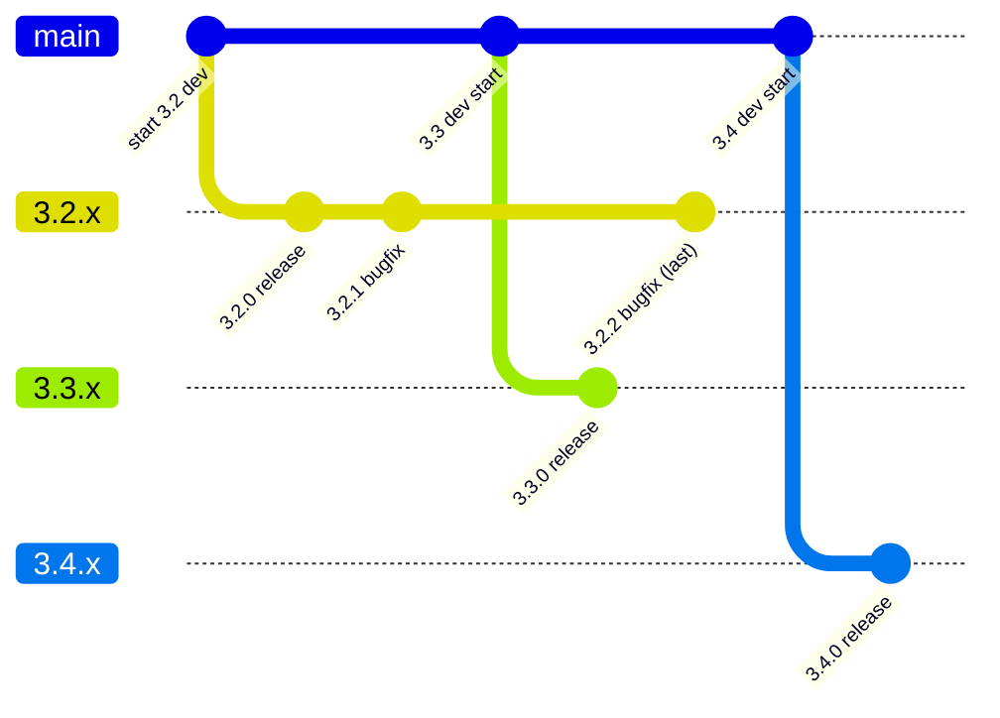

# OSS向け セマンティックバージョン運用におけるGitブランチ戦略

## 概要

セマンティックバージョニング（SemVer）を採用するOSSにおいては、以下のようなシンプルなブランチ戦略が推奨される。

-   main：次バージョン開発
-   マイナーバージョン単位の保守ブランチ（x.y.x）
-   タグによるリリース管理

------------------------------------------------------------------------

## ブランチ構成

### main

-   次のリリースバージョンの開発を行う
-   常に将来の安定版候補

### マイナーバージョンブランチ（例：3.2.x）

-   バグ修正専用
-   パッチリリース（3.2.1, 3.2.2）を管理

------------------------------------------------------------------------

## タグ運用

-   v3.2.1
-   v3.2.2

タグがリリースの正式な記録となる

------------------------------------------------------------------------

## 運用ルール

### バグ修正フロー

1.  対象バージョンのブランチで修正
2.  mainへ反映（forward-port）

### 新機能

-   mainのみで開発
-   保守ブランチには入れない

### サポート期間

-   最新 + 1世代前まで保守
-   それ以前はEOL

------------------------------------------------------------------------

## リリースフロー（任意）

-   release/x.y.0 ブランチを作成
-   RC（Release Candidate）作成
-   リリース後は削除または統合

------------------------------------------------------------------------

## 構成例

    main (3.3.x 開発中)
     ├─ feature/xxx
     ├─ feature/yyy

    3.2.x（保守）
     ├─ bugfix/aaa

    tags:
     v3.2.0
     v3.2.1

------------------------------------------------------------------------

## ブランチ戦略＋EOLタイミング（Mermaid）

以下の図は、マイナーバージョン保守ブランチの作成タイミングと、EOL判断の流れを示します。

### 図の読み解き

- `main` は常に次のバージョン開発を指す
- `x.y.x` はリリース後のバグ修正専用
- サポート対象は「最新 + 1世代前」までとし、それ以前はEOL

------------------------------------------------------------------------

## Git-flowとの違い

-   OSSではGit-flowは重すぎる
-   trunk-based + リリースブランチが主流

------------------------------------------------------------------------

## アンチパターン

-   パッチ単位でブランチ作成
-   mainが不安定
-   バージョン間の差異が大きすぎる

------------------------------------------------------------------------

## まとめ

-   main：次バージョン
-   x.y.x：保守
-   tag：リリース
-   サポート期間を明確化

この戦略はシンプルでスケーラブルであり、多くのOSSで採用されている。
