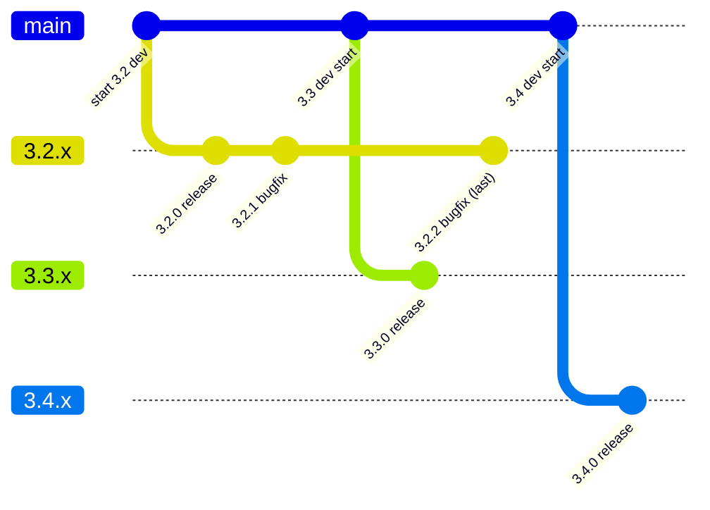
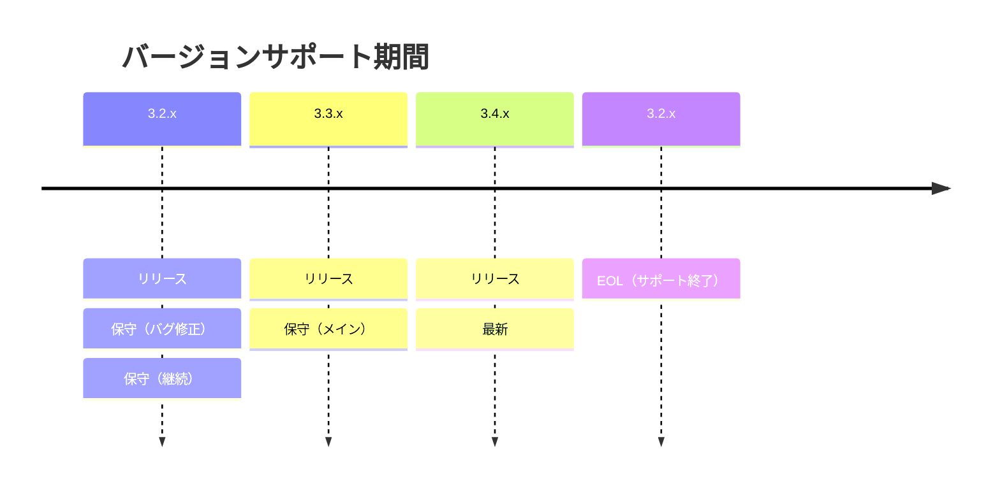
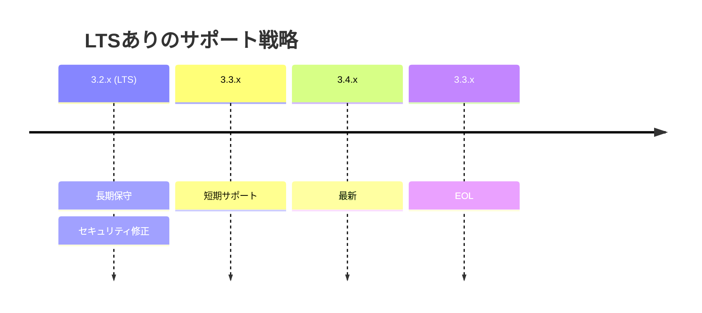

# OSS向け セマンティックバージョン運用におけるGitブランチ戦略

## 概要

セマンティックバージョニング（SemVer）を採用するOSSにおいては、以下のようなシンプルなブランチ戦略が推奨される。

-   main：次バージョン開発
-   マイナーバージョン単位の保守ブランチ（x.y.x）
-   タグによるリリース管理

------------------------------------------------------------------------

## ブランチ構成

### main

-   次のリリースバージョンの開発を行う
-   常に将来の安定版候補

### マイナーバージョンブランチ（例：3.2.x）

-   バグ修正専用
-   パッチリリース（3.2.1, 3.2.2）を管理

------------------------------------------------------------------------

## タグ運用

-   v3.2.1
-   v3.2.2

タグがリリースの正式な記録となる

------------------------------------------------------------------------

## 運用ルール

### バグ修正フロー

1.  対象バージョンのブランチで修正
2.  mainへ反映（forward-port）

### 新機能

-   mainのみで開発
-   保守ブランチには入れない

### サポート期間

-   最新 + 1世代前まで保守
-   それ以前はEOL

------------------------------------------------------------------------

## リリースフロー（任意）

-   release/x.y.0 ブランチを作成
-   RC（Release Candidate）作成
-   リリース後は削除または統合

------------------------------------------------------------------------

## 構成例

    main (3.3.x 開発中)
     ├─ feature/xxx
     ├─ feature/yyy

    3.2.x（保守）
     ├─ bugfix/aaa

    tags:
     v3.2.0
     v3.2.1

------------------------------------------------------------------------

## Git-flowとの違い

-   OSSではGit-flowは重すぎる
-   trunk-based + リリースブランチが主流

------------------------------------------------------------------------

## アンチパターン

-   パッチ単位でブランチ作成
-   mainが不安定
-   バージョン間の差異が大きすぎる

------------------------------------------------------------------------

## まとめ

-   main：次バージョン
-   x.y.x：保守
-   tag：リリース
-   サポート期間を明確化

この戦略はシンプルでスケーラブルであり、多くのOSSで採用されている。

いいですね、その2つは「文章より図」の方が圧倒的に理解しやすいポイントです。
Mermaidで**ブランチ作成タイミング＋EOL判断**を1枚にまとめるとこうなります。

---

## ■ ブランチ戦略＋EOLタイミング（Mermaid）

---

## ■ 読み解き（重要ポイント）

### ① 保守ブランチを切るタイミング

👉 **マイナーリリース直前 or 直後**

* `3.2.x` は **3.2.0リリース時に確定**
* それ以降は「安定版の修正専用」

---

### ② 次バージョン開発の開始

* `main` は常に次を指す

  * 3.2リリース後 → 3.3開発へ
  * 3.3リリース後 → 3.4開発へ

---

### ③ EOL（End of Life）のタイミング

図にするとこういうルールになります：

👉 ルール：

* **「最新 + 1つ前」までサポート**
* それより古いものはEOL

---

## ■ シンプルな運用ルール（図から抽出）

* `3.2.0` リリース → `3.2.x` 作成
* `3.3.0` リリース → `3.3.x` 作成
* `3.4.0` リリース → この時点で `3.2.x` をEOL

---

## ■ 実務でよくある拡張

### LTSを入れる場合

---

## ■ 補足（現実的な判断基準）

EOLは機械的に決めるだけでなく：

* 利用者数
* 依存ライブラリの寿命
* セキュリティリスク

で調整するのが普通です。
